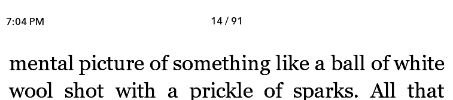
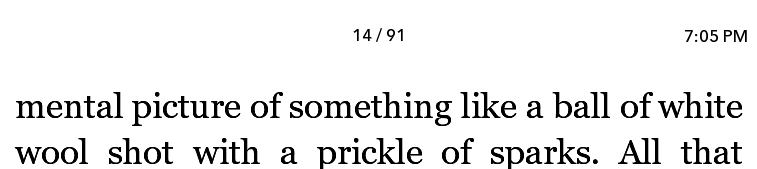
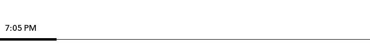
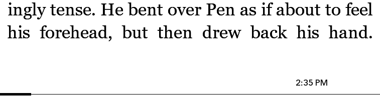

# NickelClock - Show time while reading

A Nickel mod to show time while reading on Kobo ereaders.

This mod adds a clock to the header or footer while reading a book. It is an 
alternative to [miniclock](https://www.mobileread.com/forums/showpost.php?p=3762123&postcount=6) 
and [NanoClock](https://github.com/NiLuJe/NanoClock).

### Examples

*Header - Left*


*Header - Right*


*Footer - Left*


*Footer - Right*


## Install NickelClock

1. Download the `NickelClock.zip` file from the [latest](https://github.com/shermp/NickelClock/releases/latest) 
   release. Extract the `KoboRoot.tgz` file from the downloaded file 
   (note: Mac OS X may extract this by default on download).
2. Copy `KoboRoot.tgz` to the `.kobo` directory on your Kobo, and disconnect 
   it from your computer. The Kobo will reboot automatically.

## Configure NickelCLock

The clock may be displayed in one of four locations on the screen. They are:

- Header
    - left
    - right
- footer
    - left
    - right

You can set this location in `.adds/nickelclock/settings.ini`. The default 
settings file contains:

```ini
[General]
placement=header
position=right
```

The allowed values for `placement` are:
- `header`
- `footer`

The allowed values for `position` are:
- `left`
- `right`

No other customisation is available at this time.

If you have disabled your header and/or footer, the clock may not show.

## Compatibility

NickelClock should be compatible with any Kobo device running a recent 4.x 
firmware release. It has currently been tested to work on firmware 4.33.

## Uninstall NickelClock

To uninstall NickelClock, simply delete the `uninstall.txt` file from the
`.adds/nickelclock` directory, then restart your Kobo.

## FAQ

### How does this differ from MiniClock/NanoClock?

NickelClock works in a fundamentally different way to MiniClock or NanoClock. 
They directly print to the screen wheras NickelClock creates a Widget that 
Kobo's software displays.

MiniClock and NanoClock are much more configurable than NickelClock is. If 
you want precise control over the positioning and appearance of your clock, 
NickelClock is probably not what you want to use.

MiniClock/NanoClock have known stability issues with newer devices, especially 
the Kobo Libra2. NickelClock should not have such stability issues.
