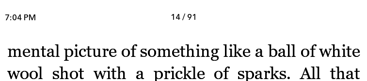
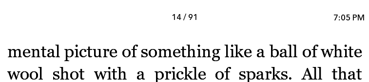
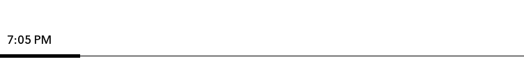
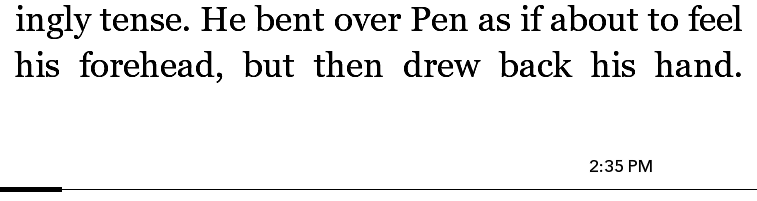

# NickelClock - Show time while reading

A Nickel mod to show time while reading on Kobo ereaders.

This mod adds a clock to the header or footer while reading a book. It is an 
alternative to [miniclock](https://www.mobileread.com/forums/showpost.php?p=3762123&postcount=6) 
and [NanoClock](https://github.com/NiLuJe/NanoClock).

### Examples

*Header - Left*


*Header - Right*


*Footer - Left*


*Footer - Right*


## Install or Upgrade NickelClock

1. Download the `NickelClock-<version>.zip` file from the [latest](https://github.com/shermp/NickelClock/releases/latest) 
   release. Extract the `KoboRoot.tgz` file from the downloaded file 
   (note: Mac OS X may extract this by default on download).
2. Copy `KoboRoot.tgz` to the `.kobo` directory on your Kobo, and disconnect 
   it from your computer. The Kobo will reboot automatically.

## Configure NickelCLock

*NickelClock 0.2.0 used a different settings format. When upgrading, settings are 
automatically migrated.*

The clock and battery may be positioned independently in one of four locations: 

**Left header**, **Right header**, **Left footer**, **Right footer**

Positioning and other settings are saved in `.adds/nickelclock/settings.ini`, 
and the default settings file is as follows:

```ini
[General]
Debug=false
Margin=Auto

[Battery]
BatteryType=Level
Enabled=false
LevelTemplate=%1%
Placement=Header
Position=Left
Update=Immediate

[Clock]
ClockTemplate=h:mm ap
Enabled=true
Placement=Header
Position=Right
Update=Immediate

```
The following settings may be set. **Note that entries are case sensitive**:

### [General] settings

|Setting|Values|Detail|
|-------|------|------|
|`Margin`|`Auto`, `<n>` | Where `<n>` is any whole number greater than zero, up to a quarter of your screen width.|

### [Clock] and [Battery] settings

|Setting|Values|Detail|
|-------|------|------|
|`Placement`|`Header`, `Footer`|Whether to place the battery or clock in the header or footer.|
|`Position` |`Left`, `Right`|Which side of the header or footer to place the battery or clock.|
|`Enabled`  |`true`, `false`|Controls if the battery or clock is shown.|
|`Update`   |`Immediate`, `ContentChange`|Controls when the battery or clock updates its display. `Immediate`: Update when the time or battery level changes. `ContentChange`: Only updates when other content changes (such as a page turn).|

### [Battery] settings

|Setting|Values|Detail|
|-------|------|------|
|`BatteryType`|`Level`, `Icon`, `Both`|`Level`: Only show the battery level text. `Icon`: Only show the battery icon. `Both`: Show both level text and icon together.|
|`LevelTemplate`|Any string that contains `%1`|Defaults to `%1% (eg: 80%)|

### [Clock] settings

|Setting|Values|Detail|
|-------|------|------|
|`ClockTemplate`|Any string that contains expressions in table found [here](https://doc.qt.io/qt-6/qtime.html#toString)|Allows changing how time is displayed. Defaults to `h:mm ap` (eg: 4:05 pm)|

Setting both clock and battery level to the same placement and position is 
not supported, and the result will be neither showing.

No other customisation is available at this time.

If you have disabled the header and/or footer in the reading settings, the 
clock or battery may not show.

## Compatibility

NickelClock should be compatible with any Kobo device running a recent 4.x 
firmware release. It has currently been tested to work on firmware 4.33.

## Uninstall NickelClock

To uninstall NickelClock, simply delete the `uninstall` file from the
`.adds/nickelclock` directory, then restart your Kobo.

## FAQ

### How does this differ from MiniClock/NanoClock?

NickelClock works in a fundamentally different way to MiniClock or NanoClock. 
They directly print to the screen wheras NickelClock creates a Widget that 
Kobo's software displays.

MiniClock and NanoClock are much more configurable than NickelClock is. If 
you want precise control over the positioning and appearance of your clock, 
NickelClock is probably not what you want to use.

MiniClock/NanoClock have known stability issues with newer devices, especially 
the Kobo Libra2. NickelClock should not have such stability issues.
